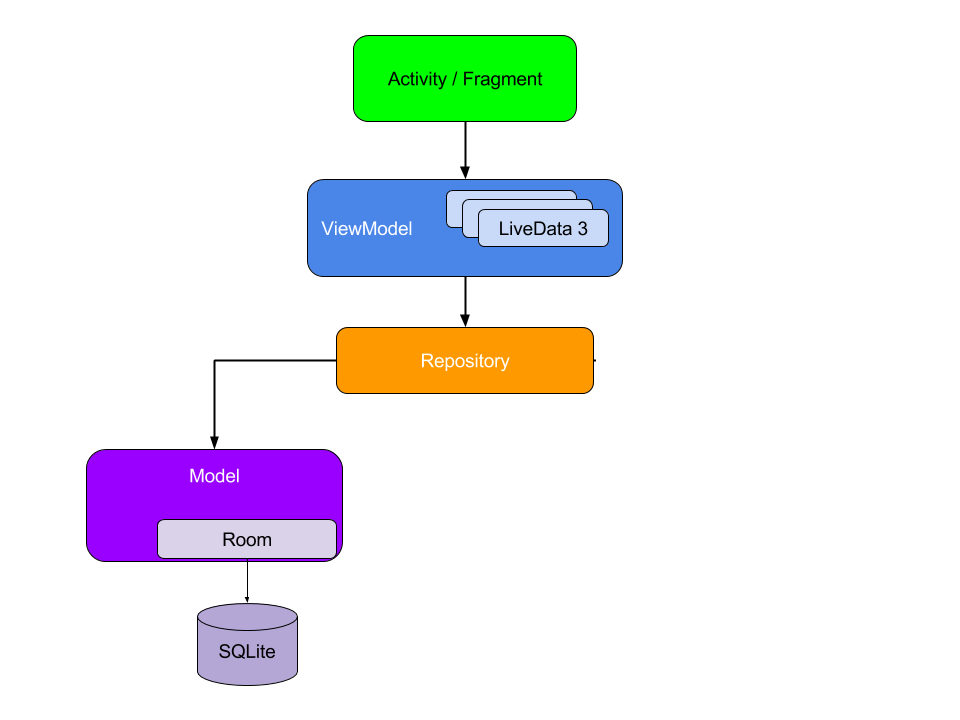

# DebtApp
Writed from scratch on my own Android Application for managing Debts in Java

## Table of contents
* [General info](#general-info)
* [Screenshots](#screenshots)
* [Architecture](#architecture)
* [Features](#features)
* [Status](#status)

## General info
I wrote this application because I have many situations (trips, meetings with friends) when at the end no one knows how much somebody to someone is owed.
This is what this application does, it stores debts in many creditors and debtors - you can select creditor and one or list of debtors so one person with smartphone and
this application can store every expense that occurs in the party.
At the end you can square it all and you get a few payment orders that will zero all the accounts.

## Screenshots

## Architecture
This is how overall architecture looks like:

Database is set to Room with means that entity (there is only Person entity) is stored on device internal memory.
Person have a list of debtSets that have all theirs debts, those debtsets are dynamically converted to JSON format by TypeConverter, in that way Person can be stored in
a database with list of objects - debts.
In DAO - DataAccessObject LiveData starts its journey, it goes up through all steps from diagram, keep the data always actual and save from changes such as for example
changing of orientation which would weep all not saved to DB data.
At the high level there are components connecting to ViewModel - the highest data access object Activities -> their job is to feel graphical interface with data and Adapters
-> they feed parts of the application with LiveData providing dynamic content.

## Features

* Store many creditors
* Designed visually for fast working and good visibility
* deleting person and debts have two levels — deactivated and deleted e.g. you can deactivate Person - that person debts will not be counted and you won't accidentally lost data.

To-do list:
* Connection to phone book
* work on different parties with different groups

## Status
Project is: _in progress_